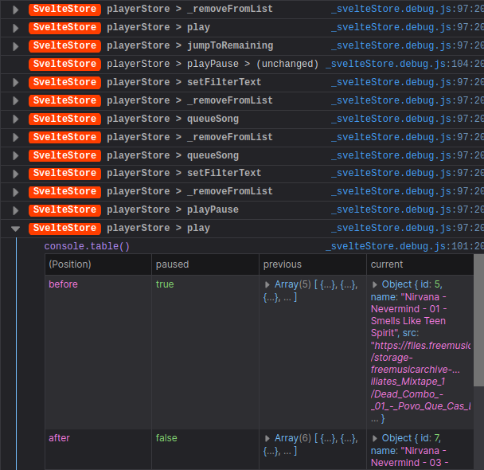
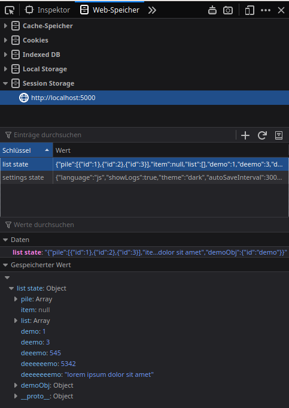

# Svelte Store

Template for client side svelte store _(unofficial)_


live demo: https://svelte.dev/repl/a76e9e11af784185a39020fec02b7733?version=3.19.1

## Quick start

```bash
npm install
npm run dev
```

Navigate to [localhost:5000](http://localhost:5000)

## Usage

- Copy `src/store/_svelteStore.js` in your project
- Create a new file `myStore.js` based on `src/store/templateStore.js` next to `_svelteStore.js`
- In `templateStore.js` replace all "templateStore" with "myStore"
- Delete everything below "Demo-Actions"
- Define initial state in `State` as simple JSON
- Write actions that call `storeIn.update(updater)` and use a _named function_ as updater

## Concept


Svelte Store aims for *separation of concerns* by covering everything needed to run a client-side application without any UI. Think of it as the CLI to your Web-App.

## Features

For detailed insight of changes or the current state , all you need is your browsers dev-tools. No plugins, zero dependencies _(besides svelte)_.

- Before/After difference on state updates
  - When in dev-mode see what has been changed over time.
  
- Full state in SessionStorage  
  - See the full state tree when in dev-mode.
  
- Persist in web-storage
  - The state can optionally persisted in localStorage by creating a store with the `persist` flag
  ```js
  const [storeIn, storeOut] = useStore(new State(), {
    name: "templateStore",
    persist: true,
  })
  ```
  - Usefull for a "Settings" store
- Audible activity
  - When `settings.tickLog` in `storeUtils.js` is turned on, every action makes a "tick"/"click" sound. This way you simply hear, when much is going on. Louder clicks mean more updates at the same time. Of course only in dev-mode.

## Rules with examples

### The "IMMUTABLE" Rule:

When your actions change something (state Object, a list inside state, etc...), **make a shallow copy of it!**

good:

```javascript
let { list } = state;

const updtedList = [...list];
updatedList.push(1234);

return { ...state, list: updatedList };
```

bad:

```javascript
let { list } = state;

// mutated objects won't be detected as a change
list.push(1234);

return Object.assign(state, { list });
```

bad:

```javascript
//every object will look like a change
let { list } = deepCopy(state);

list.push(1234);

return { ...state, list };
```

### The "PURE UPDATES" Rule:

The callbacks for `storeIn.update` must not have side-effects and return a shallow-copy-state.

Every update modifies state, so if you want to bundle **multiple actions**, they run one by one - not nested:

good:

```javascript
export const multiAction1 = () => {
  // Simple chain
  actionA()
  actionB()
  return storeIn.update(function actionC (state) {
    let { xy } = state
    …
    return { ...state, xy}
  });
}

export const multiAction2 = () => {
  // Conditional on current state
  let state = storeOut.get()
  let { xy } = state

  if (xy) {
    actionA()
  } else {
    storeIn.update(function actionB (state) {
      let { xy } = state
      …
      return { ...state, xy}
    });
  }
  return actionC()
}

export const multiAction3 = async () => {
  // Async and with updated state usage
  let state = storeOut.get()
  let { xy } = state

  if (xy) await asyncActionA()
  // re-assign updated state when using it (avoid)
  state = storeIn.update(function actionB (state) {
    let { xy } = state
    xy = await api.fetch(xy)
    return { ...state, xy}
  });

  xy = state.xy
  if (xy) return asyncActionC()

  return state
}
```

bad:

```javascript
export const multiAction1 = () => {
  // Nested actions are side-effects
  return storeIn.update(function actionA (state) {
    let { xy } = state
    state = actionB() // Don't use functions inside "update"
    actionC() // ...messes up state easily
    …
    return { ...state, xy}
  });
}

export const multiAction3 = async () => {
  // Async and with updated state usage
  let state = storeOut.get()
  let { xy } = state

  if (xy) await asyncActionA()
  // re-assign updated state when using it (avoid…)
  state = storeIn.update(function actionB (state) {
    let { xy } = state
    xy = await api.fetch(xy)
    return { ...state, xy}
  });
  // … because xy is now outdated after actionB
  if (xy) return asyncActionC()

  return state
}
```

## Anatomy of an action


