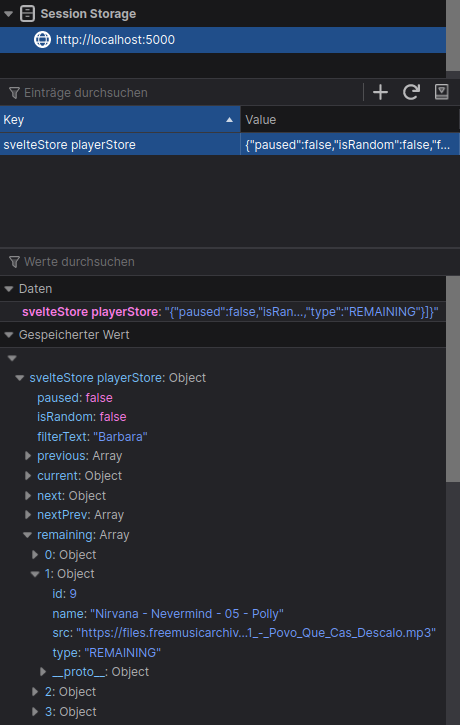

[](https://github.com/gitbreaker222/SvelteStore/actions/workflows/node.js.yml)

# Svelte Store


Template for client side svelte store _(unofficial)_


live demo: https://svelte.dev/repl/a76e9e11af784185a39020fec02b7733?version=3.31.2

## Quick start

```bash
npm install
npm run dev
```

Navigate to [localhost:5000](http://localhost:5000) and open dev-tools.

## Usage

- Copy all `src/store/_svelteStore.*` files in your project
  - For production builds _rollup_ uses tree-shaking to ignore the debug version 👍
- Create a new file `myStore.js` based on `src/store/templateStore.js` next to `_svelteStore.js`
- In `templateStore.js` replace all "templateStore" with "myStore"
- Delete everything below "Demo-Actions"
- Define initial state in `State` as simple JSON
- Write actions that call `storeIn.update(actionName, updaterFn)`

## Concept


Svelte Store aims for *separation of concerns* by covering everything needed to run a client-side application without any UI. Think of it as the CLI to your Web-App.

## Features

For detailed insight of *changes* or the *current state* , all you need is your browsers dev-tools. No plugins, zero 0️⃣ dependencies _(besides svelte)_.

- ↔️ Track state diffs
- 🔍 Inspect current state
- ⚠️ Type warnings
- 📌 Persistent storage with a single switch
- ♾️ Infinite loop detection
- 🃏 Testable Actions
- 🔉 Audible activity

### ↔️ Before/After diffs on state updates:

See what has been changed over time. *This is a debugging feature and deactivated in prod-mode.*


### 🔍 Full state in SessionStorage

See the full state tree to understand the current state behind the GUI. *This is a debugging feature and deactivated in prod-mode.*



### ⚠️ Automatic type warnings on state updates:

The initial `State` of a SvelteStore also acts as type definition for the top level fields. If an action updates a field with another type, a warning will be shown in dev-tools console. No replacement for TypeScript, but free basic type checks. *This is a debugging feature and deactivated in prod-mode.*


Learn more about native JS types at [Mozilla Developer Network: typeof](https://developer.mozilla.org/en-US/docs/Web/JavaScript/Reference/Operators/typeof#description)

### 📌 Persist in web-storage

The state can optionally persisted in localStorage by creating a store with the `persist` flag. Useful for data, that should be rememberd after a page reload or across tabs.
```js
const [storeIn, storeOut] = useStore(new State(), {
  name: "templateStore",
  persist: true,
})
```
### ♾️ Infinite loop detection

SvelteStore can break unwanted endless circles of action calls after about 3 seconds, if an action gets called with an interval of < 150 ms.

This feature can be turned off in `_svelteStore.js` with `settings.loopGuard: false`. *This is a debugging feature and deactivated in prod-mode.*

  
[screen recording of stopping infinite loops with a confirm dialog about reloading the window](./docs/infinite%20loop%20detection.webm)

If the users confirms the reload, the window is asked to reload and an error is thrown, to break e.g. `for` loops. If the dialog is canceled, the action gets ignored for 150 ms, so a long task may finish.

### 🃏 Testable Actions

SvelteStore gives you a hand getting startet with unit tests for _actions_. It's a good advice, to keep the "reset" action from the templateStore, so you can reset or override the default state before every test.


The setup in this demo-app is based on [this article][test-article] / [testing-library.com][testing-library] and uses [jest](https://jestjs.io/).

[test-article]: https://dev.to/jpblancodb/testing-svelte-components-with-jest-53h3
[testing-library]: https://testing-library.com/docs/svelte-testing-library/intro.

Go for a test ride with `npm test` or `npm run test:watch` to automatically rerun the tests on file-save ⚡.

To write a new test for an action:
1. Arrange: `reset()` the state and optionally override it
1. Act: Call an action an safe the returned new state
1. Assert: Write an expactation for the new state

See [templateStore.test.js](./src/store/templateStore.test.js) for some examples.

### 🔉 Audible activity

When `settings.tickLog` in `_svelteStore.js` is turned on, every action makes a "tick"/"click" sound. Inspired by detectors for radio-activity ☢️, this way you simply hear, when too much is going on. Louder clicks mean more updates at the same time. Of course only in dev-mode.

### Environments: Dev / Prod

No debugging-functions in production / test-runs, to improve performance. `_svelteStore.js` returns the debug version only if `process.env.NODE_ENV === 'debug'`.

|command|`NODE_ENV` value|config by|
|---|---|---|
|`npm run dev`|debug|`rollup.config.js`|
|`npm run build`|prod|`rollup.config.js`|
|`npm test`|test|[jest](https://jestjs.io/docs/getting-started#using-babel)|


## Two Rules 📖

1. IMMUTABLE
1. PURE UPDATES

### #1 - IMMUTABLE:

When your actions change something (state Object, a list inside state, etc...), **make a shallow copy of it!**

good:

```javascript
let { list } = state;

list = [...list]; // shallow copy with spread syntax
list.push(1234);

return { ...state, list };
```

bad: *mutation*

```javascript
let { list } = state;

// mutated objects won't be detected as a change
list.push(1234);

return Object.assign(state, { list });
```

bad: *deep copy*

```javascript
let { list } = deepCopy(state);
// EVERY object will look like a change
// Svelte must re-render everything instead just "list"

list.push(1234);

return { ...state, list };
```

### #2 - PURE UPDATES:

The callbacks for `storeIn.update` must not have side-effects and return a shallow-copy-state.

Every update modifies state, so if you want to bundle **multiple actions**, run them one by one - not nested:

good:

```javascript
export const multiAction1 = () => {
  actionA()
  actionB()
  // Return last update
  return storeIn.update('actionC', function (state) {
    let { xy } = state
    …
    return { ...state, xy}
  });
}

export const multiAction2 = () => {
  let state = storeOut.get()
  let { xy } = state

  // A or B depending on current state
  if (xy) {
    actionA()
  } else {
    storeIn.update('actionB', function (state) {
      let { xy } = state
      …
      return { ...state, xy}
    });
  }
  // Return last update
  return actionC()
}

export const multiAction3 = async () => {
  // Follow the state of "xy"
  let state = storeOut.get()
  let { xy } = state // xy = true

  if (xy) await asyncActionA()

  // Re-assign updated state when using it
  // Beware that this practise may leads to bugs (see bad multiAction3 below)
  state = storeIn.update('actionB', function (state) {
    let { xy } = state
    xy = await api.fetch(xy) // xy = false
    return { ...state, xy}
  });

  xy = state.xy // xy = false (!! don't forget to re-assign)
  if (xy) return asyncActionC()

  return state
}
```

bad:

```javascript
export const multiAction1 = () => {
  // Nested actions are side-effects
  return storeIn.update('actionA', function (state) {
    let { xy } = state
    state = actionB() //! Don't call functions inside "update"
    actionC() // ...messes up state easily; not pure
    …
    return { ...state, xy}
  });
}

export const multiAction3 = async () => {
  // Follow the state of "xy"
  let state = storeOut.get()
  let { xy } = state // xy = true

  if (xy) await asyncActionA()
  
  state = storeIn.update('actionB', function (state) {
    let { xy } = state
    xy = await api.fetch(xy) // xy = false
    return { ...state, xy}
  });

  // xy is still what it was before actionB. 
  // (See good: multiAction3 above)
  if (xy) return asyncActionC() // xy = true (expected false)

  return state
}
```

## Anatomy of an action


